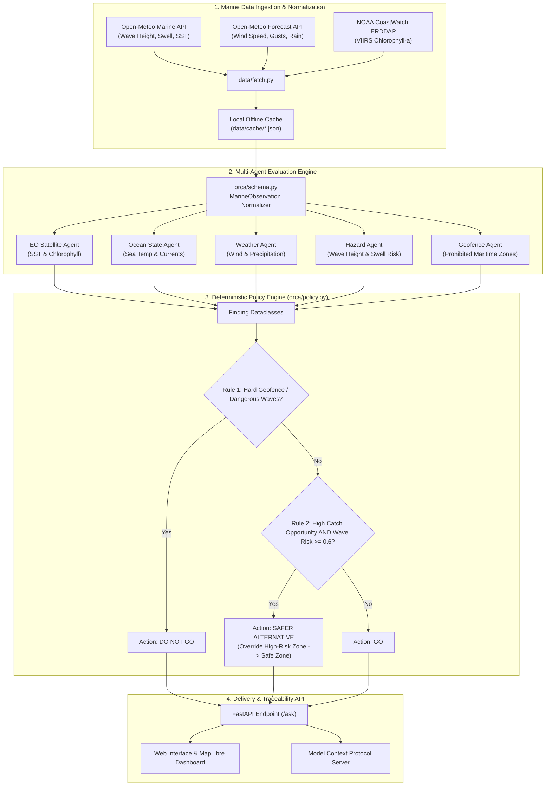
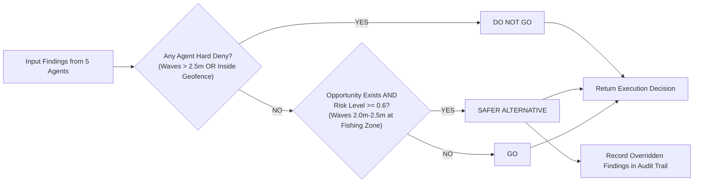
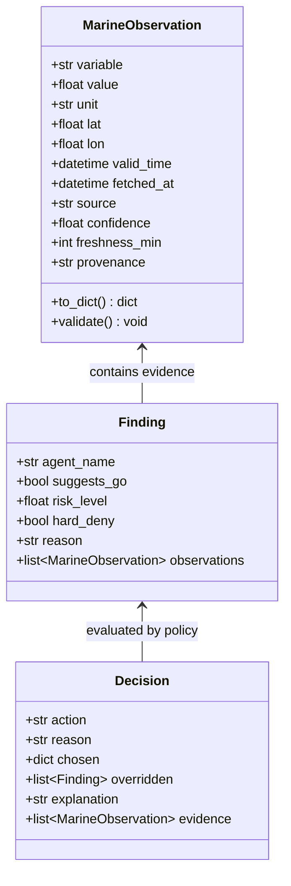

# ORCA — Oceanic Reasoning & Constraint Architecture
> **Marine Advisory & Deterministic Safety System for Indian Fishermen**  
> *Team ICARUS · SIH26176 · ISRO Software Challenge*

[](https://www.python.org/)
[](https://fastapi.tiangolo.com/)
[](#testing)
[](#deterministic-safety-policy)
[](#data-traceability--schema)

---

## Executive Summary

India's marine monitoring ecosystem (ISRO, INCOIS, DGLL, NOAA) generates rich satellite oceanography, wave height forecasts, and meteorological warnings. However, a fisherman setting out at 4:00 AM does not want to navigate multiple fragmented portals or interpret raw charts. He needs **one unambiguous answer**: *Where do I go, when do I return, and is it safe?*

**ORCA** is an intelligent reasoning and safety layer that synthesizes multi-source marine observations, detects safety vs. opportunity conflicts, and enforces a **deterministic safety override policy in code**. 

> *"A good catch never outranks a safe return home."*

---

## Key Innovations & Core Differentiators

| Feature | Existing Apps (SAMUDRA, FFMA, Sagar Vani) | ORCA |
| :--- | :--- | :--- |
| **Output Type** | Multi-chart data display & raw forecast maps | **Single actionable decision** with explicit evidence |
| **Conflict Resolution** | Left to user interpretation / LLM blending | **Deterministic Python Policy Engine** (Zero LLM reliance for safety) |
| **Safety Guarantee** | Soft warnings | **Hard Safety Override**: Safety ALWAYS beats opportunity |
| **Data Traceability** | Aggregated values / opaque predictions | **100% Provenance**: Source, timestamp, confidence, & dataset ID per number |
| **Offline Resilience** | Fails or shows empty screen offshore | **Offline-First Cache & Degraded Confidence Engine** |
| **Synthetic Fallbacks** | Silent mock fallback when API fails | **Strict Prohibition**: Raises errors on failure; zero fabricated data |
| **Conversational Query** | Structured push (SMS/IVRS) or a search box matched to exact zone names | **Agentic chatbot layer** (`orca/agentic.py`): free-text, real-language queries resolved onto real zones, phrased in the query's own language — deterministic policy untouched, network calls fail closed to the same offline behavior above |

---

## System Architecture

ORCA employs a modular, multi-agent architecture where domain agents evaluate normalized marine observations. Findings are passed into a **deterministic safety policy engine** that resolves contradictions before formatting the final advisory.



---

## Deterministic Safety Policy

Safety rules in ORCA are implemented strictly in deterministic Python (`orca/policy.py`) with zero language model calls. This guarantees that LLM hallucinations or prompt injections can **never** override a critical safety boundary.

### Decision Execution Flowchart



### Scenario Example: Safety Override in Action

This is the illustrative case from the war plan (S8.4), and it's exactly
what `tests/test_agents.py::test_hazard_flip_from_dangerous_to_safe_matches_demo_scenario`
and `tests/test_planner.py::test_build_recommendation_flip_wave_height_changes_decision_end_to_end`
verify mechanically — flipping wave height across the 2.5m line flips the
decision, end to end:

1. **Ocean State Agent**: Recommends **Nagapattinam** (SST 28.4°C, high chlorophyll, strong aggregation).
2. **Hazard Agent**: Flags **Nagapattinam** with significant wave height of **3.1 meters** — exceeds the hard-deny threshold.
3. **Policy Engine Evaluation**:
   - Detects contradiction between catch opportunity and hazard risk.
   - **Enforces Safety Override**: rejects Nagapattinam, searches other real zones.
   - **Selects a clean alternative** (e.g. Karaikal, the nearest real fishing harbour) if one resolves to GO.
   - **Audit trail recorded**: which agent's opportunity finding was overridden and why.

**Note on live data:** real wave heights sampled at our coastal points
during this build stayed well under 2.5m (nearshore, sheltered water).
The override mechanism above is real and tested, but the demo's actual
*live* conflict on any given day is more often wind-driven (see
`orca/agents.py`'s `weather_agent` and `demo/scenarios.json`, which is a
transcript generated from the real running system, not hand-written).
Run `python scripts/generate_demo_scenarios.py` to see what's live now.

---

## Data Traceability & Schema

Every numerical measurement presented to a fisherman or API consumer is strictly wrapped in a `MarineObservation` model. Bare floating-point numbers without provenance are rejected at system boundaries.



---

## Repository Structure

```
ORCA/
├── CLAUDE.md                   # Development rules & hard constraints
├── API_CONTRACT.md             # REST API specification & response contracts
├── ORCA-32-HOUR-WAR-PLAN-v3.md # SIH Hackathon execution war plan
├── TEAM_STATUS.md              # Current build status, for teammates/other agents
├── MANUAL_TASKS.md             # What still needs a human (audio, deck, laptop test...)
├── SCRATCH.md                  # Build log: surprises, real API quirks found along the way
├── pyproject.toml              # pytest config
├── requirements.txt            # Python dependencies (FastAPI, uvicorn, requests, mcp, ...)
├── package.json                # Playwright e2e test tooling (dev-only, not app runtime)
├── playwright.config.js        # Boots both real servers, runs e2e headless
├── data/
│   ├── fetch.py                # Real fetchers: Open-Meteo x2, NOAA ERDDAP (only file allowed to touch the network)
│   └── cache/                  # Real cached observations (*.json) -- the API reads only from here
├── orca/
│   ├── schema.py                # MarineObservation dataclass & validation logic
│   ├── policy.py                # Deterministic safety override engine (no LLM calls)
│   ├── agents.py                # 5 domain agents (EO, ocean state, weather, hazard, geofence)
│   ├── planner.py                # query -> agents -> policy.resolve() -> structured answer
│   ├── api.py                   # FastAPI endpoints (/ask, /evidence/{id}, /health)
│   └── mcp_server.py             # ORCA as an MCP server (stretch goal, S6.2)
├── web/
│   ├── index.html               # Self-contained dashboard: MapLibre + evidence panel
│   └── mock_response.json       # Fixture for `?mock=1` isolated frontend dev/tests
├── scripts/
│   └── generate_demo_scenarios.py  # Regenerates demo/scenarios.json from the real live API
├── tests/                       # 103 pytest tests -- see TEAM_STATUS.md for the breakdown
│   └── fixtures/                # Real, previously-captured API responses used in unit tests
├── e2e/                         # 12 Playwright tests, run headless against real servers
└── demo/
    └── scenarios.json           # REAL transcript from the live API, not hand-written
```

---

## Quick Start Guide

### 1. Prerequisites
- **Python**: Version 3.11 or 3.12 installed.

### 2. Installation
Clone the repository and install dependencies:

```bash
git clone https://github.com/Anbu-00001/ORCA.git
cd ORCA
python3 -m venv .venv
source .venv/bin/activate
pip install -r requirements.txt
```

### 2b. Chatbot agentic layer (Optional - ORCA runs fully offline without it)
`/ask` works exactly as always with no setup. To also enable LLM-assisted
zone resolution (free text like "the harbour jetty at Rameswaram" or "the
southernmost tip of India" → the real zone, not just an exact name match)
and localized, natural-language phrasing (including real Tamil, not just
canned templates) — see `orca/agentic.py`:

```bash
cp .env.example .env      # then fill in a free key from console.groq.com/keys
source .env
```
With `GROQ_API_KEY` unset, or if Groq is unreachable, every response is
byte-for-byte what it always was (CLAUDE.md rule 8) — this is additive,
never a dependency for the demo to run.

### 3. Ingest Real Marine Data (Optional - Offline Cache Included)
To refresh the real cached marine data for the Tamil Nadu coast (Nagapattinam / Chennai):

```bash
python data/fetch.py
```

### 4. Run Test Suite
Verify that the unit and integration tests pass (148, plus 1 more if
`GROQ_API_KEY` is set — see 2b above):

```bash
pytest -v
```

### 4b. Run the end-to-end browser tests (Playwright, headless)
Boots a real static file server and a real FastAPI server itself:

```bash
npm install
npx playwright install chromium
npx playwright test
```

### 5. Launch API Server
Start the FastAPI server:

```bash
uvicorn orca.api:app --reload --host 0.0.0.0 --port 8000
```

- **Interactive API Docs (Swagger UI)**: `http://localhost:8000/docs`
- **Health Check Endpoint**: `http://localhost:8000/health`

### 6. Launch Web Dashboard
Open `web/index.html` in any web browser, or serve it via Python:

```bash
python -m http.server 8080 --directory web
```
Navigate to `http://localhost:8080` to view the MapLibre map and evidence dashboard.

### 7. Run the MCP server (stretch goal)
Exposes the same reasoning layer to any MCP client (Claude, a helpdesk
bot, a control-room dashboard) as callable tools, not just the web page:

```bash
python -m orca.mcp_server
```

---

## More documentation

- [`TEAM_STATUS.md`](TEAM_STATUS.md) — what's built, what's verified, architecture decisions worth knowing before you change something.
- [`MANUAL_TASKS.md`](MANUAL_TASKS.md) — what still needs a human (Tamil audio, deck work, laptop testing, venue logistics).
- [`SCRATCH.md`](SCRATCH.md) — build log of real API surprises found along the way.

---

## Prior Art & Comparative Alignment

**Roadmap, not built yet** — the prototype runs on Open-Meteo + NOAA
ERDDAP (see `data/fetch.py`); the adapter layer is source-agnostic by
design, so plugging these in later is a config change, not a rewrite.
Don't present these as live integrations.

| System | Provider | Scope | Planned ORCA integration |
| :--- | :--- | :--- | :--- |
| **INCOIS SAMUDRA** | INCOIS | Official advisories & ocean state maps | Ingest SAMUDRA datasets via the same adapter pattern as `data/fetch.py`. |
| **Fisher Friend (FFMA)** | MSSRF | Multi-hazard alerts & PFZ guidance | Sit as a decision layer above raw FFMA alerts. |
| **Sagar Vani** | INCOIS | Multi-channel alert broadcasts | Format ORCA decisions into Sagar Vani's dissemination channels. |
| **NavIC Messaging** | ISRO | Satellite broadcast to offshore vessels | Fit decision output into NavIC's signal payload. |
| **DGLL NAVTEX** | DGLL | 518 kHz maritime safety radio broadcasts | Generate structured text advisories for NAVTEX transmission. |

---

## Compliance & Hard Rules

As defined in [`CLAUDE.md`](CLAUDE.md):
1. **Zero Synthetic Data**: If an external marine source fails, the observation is omitted and flagged; synthetic placeholders are strictly prohibited.
2. **No Swallowed Exceptions**: Bare `except: pass` is prohibited across all modules.
3. **Traceability First**: Every float passed to users must carry a complete `MarineObservation` provenance trail.
4. **Deterministic Safety Policy**: `orca/policy.py` contains zero LLM calls and is covered by strict unit tests.
5. **Offline Reliability**: The entire system operates without internet connectivity using `data/cache/`.

---

## Author & Acknowledgments

- **Team**: Team ICARUS (SIH26176)
- **Challenge**: Smart India Hackathon 2026 / ISRO Software Challenge
- **Repository**: [https://github.com/Anbu-00001/ORCA](https://github.com/Anbu-00001/ORCA)
